<!-- ═══════════════════════════ HERO ═══════════════════════════ -->

  

  

  
  
  
  
  

<!-- ═══════════════════════════ ABOUT ═══════════════════════════ -->
## 👋 About Me

Hey there! I'm **Vedank**, a developer who loves building systems that stay **fast, correct and observable** under real-world load. I like taking an idea from a whiteboard sketch all the way to a tested, containerized, CI-verified service.

- 🔭 I’m currently working on **event-driven backends**: a real-time payment transaction switch (Spring Boot + Kafka) and **SentinelAI**, an automated PR reviewer (Go + Python + Redis)
- 🌱 I’m currently learning **Kubernetes, Terraform** and distributed-systems internals like consensus, event sourcing and CQRS
- 🧵 I enjoy **concurrency problems**: lock-free rate limiters, thread-safe caches, multi-threaded crawlers
- 🎯 My goal is to grow into a **backend / platform engineer** who ships reliable, well-tested infrastructure
- 💬 Ask me about **Java, Spring Boot, Kafka, Docker or system design**. Always happy to chat!

<!-- ═══════════════════════════ TECH STACK ═══════════════════════════ -->
## 🛠️ My Tech Stack

<table>
<tr>
<td width="140"><b>🎨 Frontend</b></td>
<td>

</td>
</tr>
<tr>
<td><b>⚙️ Backend</b></td>
<td>

</td>
</tr>
<tr>
<td><b>🧰 Tools</b></td>
<td>

</td>
</tr>
<tr>
<td><b>💻 OS</b></td>
<td>

</td>
</tr>
</table>

<!-- ═══════════════════════════ ARTICLES ═══════════════════════════ -->
## ✍️ My Most Recent Articles

<!-- Replace the placeholders below with links to your latest posts -->
- 📝 [Building a Lock-Free Per-Host Rate Limiter in Java](https://YOUR_BLOG_LINK_1) · *Medium*
- 📝 [Event Sourcing and CQRS from First Principles](https://YOUR_BLOG_LINK_2) · *Dev.to*
- 📝 [Idempotency Keys: Making Payment APIs Safe to Retry](https://YOUR_BLOG_LINK_3) · *Hashnode*
- 📝 [What I Learned Writing an LRU/LFU Cache from Scratch](https://YOUR_BLOG_LINK_4) · *Medium*

<!-- ═══════════════════════════ STATS ═══════════════════════════ -->
## 📊 GitHub Statistics

<table align="center">
<tr>
<td align="center"></td>
<td align="center"></td>
</tr>
</table>

<!-- ═══════════════════════════ ACTIVITY GRAPH ═══════════════════════════ -->
## 📈 Contribution Activity Graph

  

  

<!-- ═══════════════════════════ FOOTER ═══════════════════════════ -->

  

<!-- The animated hero, divider and footer come from scripts/generate_art.py; stats + chart refresh daily via .github/workflows/profile-cards.yml; the snake via .github/workflows/snake.yml -->
